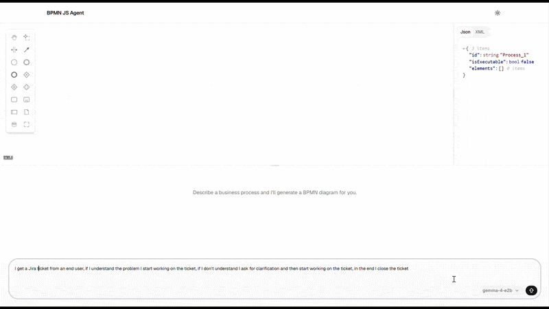

# BPMN JS AGENT


This is a demo repository to show how local LLM models can be used in the browser, in this case, to conversationally build and update a BPMN diagram. 

The bpmn editor is from [bpmn-js](https://github.com/bpmn-io/bpmn-js). 
The app also draws inspiration from this [project](https://github.com/jtlicardo/bpmn-assistant) and its associated paper for choosing to use structured JSON as the output for the LLM. 

The supported models are gemma-4-e2b and gemma-4-e4b. The app downloads the selected model once and reuses it on subsequent visits. Google's [litert-lm](https://developers.google.com/edge/litert-lm/overview) is to run the LLM. 


You can access the [live demo here](https://beemnet20.github.io/bpmn-js-agent). 

## Demo



## Development

### Prerequisites

- [Node.js](https://nodejs.org/) (v18 or later)
- npm

### Setup

Clone the repository and install dependencies:

```bash
git clone https://github.com/beemnet20/bpmn-js-agent.git
cd bpmn-js-agent
npm install
```

### Running locally

```bash
npm run dev
```

The app will be available at `http://localhost:5173`.


